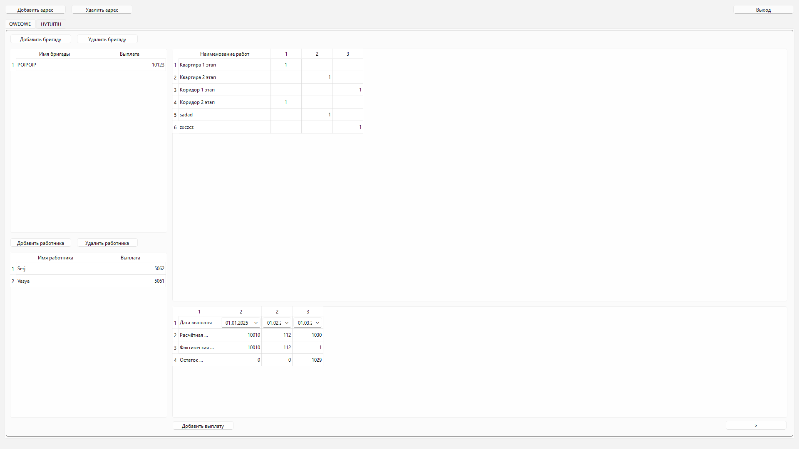
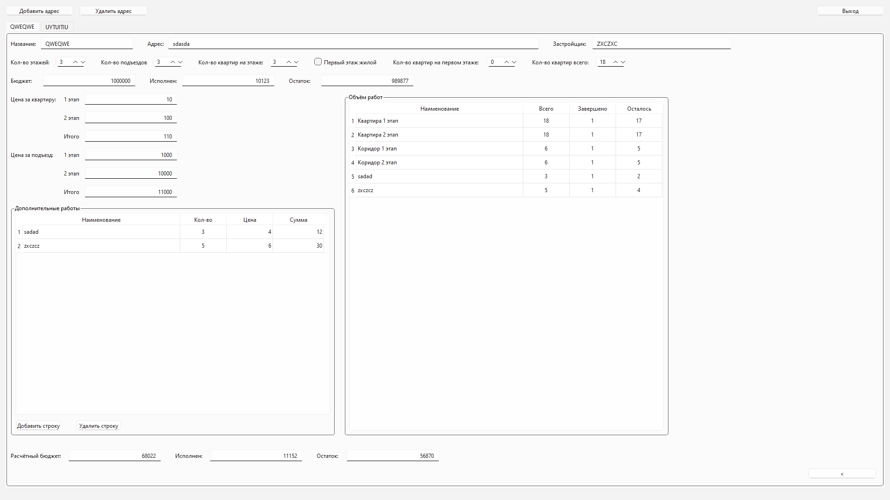

### Программа для учёта объёма работ и оплаты на объекте.

Главное окно  

Первая страница  

Вторая страница  

Программа написана для опыта использования динамически создаваемых виджетов.
Сохранение введённых данных.

The program is written for the experience of using dynamically created widgets.
Saving the entered data.

QT creastor widgets dynamic
